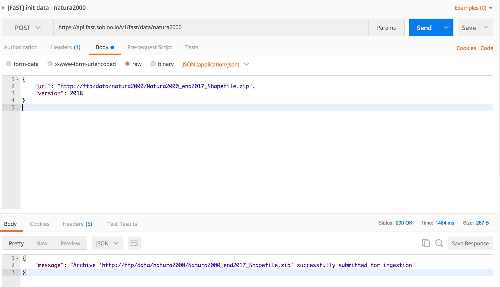

# Natura 2000 (European Environment Agency) data ingestion

## Data source 


### Description
Natura 2000 is an ecological network of protected areas, set up to ensure the survival of Europe's most valuable species and habitats.

### Links
Dataset: [https://www.eea.europa.eu/data-and-maps/data/natura-9#tab-gis-data](https://www.eea.europa.eu/data-and-maps/data/natura-9#tab-gis-data)

## Data ingestion

### The microservice pipeline

The ingestion workflow is based on a microservice pipeline developed in python and orchestrated using the Nuclio serverless framework.

These microservices are scalable, highly available and communicate with each other using a Kafka broker/topic enabling the distribution of process workload with buffering and replay capabilities.

The source code of the microservices involved in the pipeline can be found in the ```./pipelines/eea```directory:

* **00-http-handler**:
expose an API to trigger the ingestion pipeline. It forges a download command from an http POST request and send it to next microservice (01-http-processor).
* **01-http-processor**:
upon receipt of a download command, it downloads and ingests the submitted shapefile archive and sends each record as a GeoJSON feature to the next microservice (02-http-ingestion).
* **02-http-ingestion**:
upon receipt of a GeoJSON feature, a reprojection to the EPSG:4326 CRS is performed before upserting the feature in a MongoDB collection.

### Kafka topics and MongoDB collection

The ```00-boostrap.yaml``` file contains the declarative configuration of two Kafka topics and the ```natura2000``` Mongodb collection with a ```2dsphere``` index on the geometry field.

## Install & deployment

### Docker

The first step is to encapsulate the microservices in Docker containers. The actions of building, tagging and publishing Docker images can be performed using the provided Makefiles.

For each microservice (00-http-handle,01-http-processor and 02-http-ingestion) execute the following bash commands:
1. ```make build``` to build the container image
2. ```make tag``` to tag the newly built container image
3. ```make publish``` to publish the container image on your own Docker repository.

The repository, name and tag of each Docker container image can be overridden using the environment variables DOCKER_REPO, IMAGE_NAME and IMAGE_TAG:
```bash
$> make DOCKER_REPO=index.docker.io IMAGE_NAME=eufast/natura2000-pipe-http-trigger IMAGE_TAG=0.2.0 tag
```

### Nuclio / Serverless framework

The Nuclio Serveless framework provides a simple way to describe and deploy microservices (seen as functions) on top of platforms like Kubernetes. In our case, Nuclio handles the subscription to the kafka topics and the execution of the function upon receipt of messages.

A basic configuration is provided and works as is. Don't forget to specify the Docker image created previously. Many configurations are available as the number of replicas, environment variables, resources and triggers.

```yaml
apiVersion: nuclio.io/v1beta1
kind: Function
metadata:
  name: natura2000-pipe-http-trigger
  namespace: fast-platform
  labels:
    platform: fast
    module: core
    data: natura2000
spec:
  alias: latest
  description: Forge a download command from an http POST request
  handler: main:handler
  image: eufast/natura2000-pipe-http-trigger:0.1.0
  replicas: 1
  maxReplicas: 3
  targetCPU: 80
  runtime: python:3.6
  env:
  - name: KAFKA_BOOTSTRAP_SERVER
    value: "kafka-broker.kafka:9092"
  - name: TARGET_TOPIC
    value: natura2000-pipe-download
  resources:
    requests:
      cpu: 10m
      memory: 64Mi
    limits:
      cpu: 1
      memory: 1Gi 
  triggers:
    http:
      attributes:
        ingresses:
          "dev":
            host: api.fast.sobloo.io
            paths:
            - /v1/fast/data/natura2000
      kind: http
      maxWorkers: 5
  version: -1
status:
  state: waitingForResourceConfiguration
```

Please refer to the [official Nuclio documentation](https://nuclio.io/docs/latest/) for more information.

### Kubernetes

To deploy the pipeline on Kubernetes, apply the following YAML manifests:

```bash
$> kubectl create -f 00-bootstrap.yaml
```

```bash
$> cd pipelines/eea
```

```bash
$> kubectl create -f 00-http-trigger/function.yaml
$> kubectl create -f 01-archive-processor/function.yaml
$> kubectl create -f 02-datastore-ingestion/function.yaml
```

Then check the status of Kubernetes pods:

```bash
$> kubectl -n fast-platform get pod -l module=core,data=natura2000 --show-all

NAME                                                 READY     STATUS      RESTARTS   AGE
bootstrap-natura2000-data-f8n8c                      0/2       Completed   0          4m
natura2000-pipe-archive-processor-76c557fbcf-zdk7j   1/1       Running     0          4m
natura2000-pipe-http-trigger-c6564f5df-vt64p         1/1       Running     0          4m
natura2000-pipe-ingestion-79dbb87b56-7wf64           1/1       Running     0          4m
```

### Ingestion

To trigger the ingestion of the data, execute a HTTP POST request as shown below using Postman:



